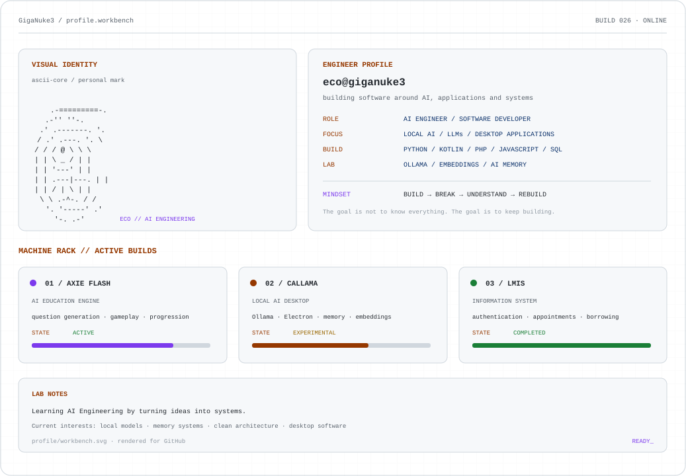

<picture>
  <source media="(prefers-color-scheme: dark)" srcset="profile_dark.svg">
  <source media="(prefers-color-scheme: light)" srcset="profile_light.svg">
  
</picture>

<picture>
  <source media="(prefers-color-scheme: dark)" srcset="https://raw.githubusercontent.com/GigaNuke3/GigaNuke3/output/pacman-contribution-graph-dark.svg">
  <source media="(prefers-color-scheme: light)" srcset="https://raw.githubusercontent.com/GigaNuke3/GigaNuke3/output/pacman-contribution-graph.svg">
  
</picture>

<picture>
  <source media="(prefers-color-scheme: dark)" srcset="graph_dark.svg">
  <source media="(prefers-color-scheme: light)" srcset="graph_light.svg">
  
</picture>

<picture>
  <source media="(prefers-color-scheme: dark)" srcset="activity_dark.svg">
  <source media="(prefers-color-scheme: light)" srcset="activity_light.svg">
  
</picture>

  <strong>AI ENGINEERING · SOFTWARE · LOCAL AI</strong>

  <a href="mailto:gorospeedilcon@gmail.com">Email</a>
  ·
  <a href="https://github.com/GigaNuke3">GitHub</a>

