<!-- ══════════════════════════════════════════════════════════════════
     GigaNuke3 — terminal profile card
     profile.png (left) + system readout (right)
     NOTE: the GITHUB stats below are a manual snapshot; the animated
     cards further down re-render automatically with live data.
     ══════════════════════════════════════════════════════════════════ -->

<table style="width:100%; background:#0d1117; border:1px solid #30363d; border-radius:12px; border-collapse:separate; border-spacing:0;">
  <tr>
    <td colspan="2" style="padding:10px 18px; border-bottom:1px solid #21262d; color:#8b949e; font-family:ui-monospace,SFMono-Regular,Menlo,Consolas,'Courier New',monospace; font-size:12px;">
      &#9679; &#9679; &#9679;&nbsp;&nbsp;giganuke3@github: ~/profile
    </td>
  </tr>
  <tr>
    <td style="padding:20px; vertical-align:middle; width:232px;">
      
    </td>
    <td style="padding:20px 22px 20px 6px; vertical-align:middle;">
      <pre style="margin:0; border:none; background:transparent; color:#c9d1d9; font-family:ui-monospace,SFMono-Regular,Menlo,Consolas,'Courier New',monospace; font-size:12.5px; line-height:1.7; white-space:pre;">eco@giganuke3 &#9612;
&#9472;&#9472;&#9472;&#9472;&#9472;&#9472;&#9472;&#9472;&#9472;&#9472;&#9472;&#9472;&#9472;&#9472;&#9472;&#9472;&#9472;&#9472;&#9472;&#9472;&#9472;&#9472;&#9472;&#9472;&#9472;&#9472;&#9472;&#9472;&#9472;&#9472;&#9472;&#9472;&#9472;&#9472;&#9472;&#9472;&#9472;&#9472;

AI ENGINEER / SOFTWARE DEVELOPER
Local AI &#183; LLMs &#183; Desktop Applications &#183; Web Development

SYSTEMS
Local AI / LLMs / Desktop Applications

STACK
Python &#183; Kotlin &#183; PHP &#183; JavaScript &#183; SQL
Ollama &#183; LLMs &#183; Embeddings &#183; AI Memory

LANGUAGES
English &#183; Filipino

PROJECTS
Axie Flash   [AI EDUCATION]
Callama      [LOCAL AI DESKTOP]
LMIS         [INFORMATION SYSTEM]

GITHUB
Repos 9 &#183; Stars 2 &#183; Followers 1
Commits 562

github.com/GigaNuke3</pre>
    </td>
  </tr>
</table>

<picture>
  <source media="(prefers-color-scheme: dark)" srcset="tetris_dark.svg">
  
</picture>

<picture>
  <source media="(prefers-color-scheme: dark)" srcset="graph_dark.svg">
  
</picture>

<picture>
  <source media="(prefers-color-scheme: dark)" srcset="activity_dark.svg">
  
</picture>

  
<strong>AI ENGINEERING · SOFTWARE · LOCAL AI</strong>

  
<a href="https://github.com/GigaNuke3">GitHub</a>

