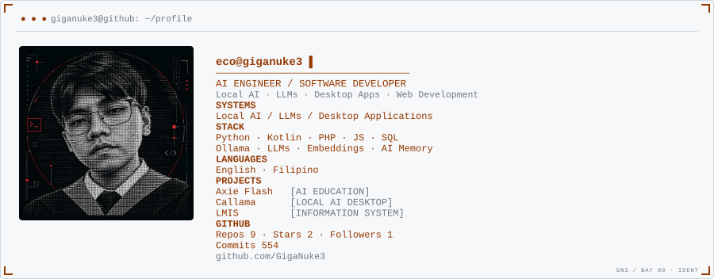

<!-- ══════════════════════════════════════════════════════════════════
     GigaNuke3 — compact terminal profile
     The header card is generated (dark_mode.svg / light_mode.svg) and
     renders profile.png + the orange terminal readout inside an SVG,
     because GitHub strips inline CSS from README HTML.
     The animated cards below re-render automatically with live data.
     ══════════════════════════════════════════════════════════════════ -->

<picture>
  <source media="(prefers-color-scheme: dark)" srcset="dark_mode.svg">
  
</picture>

<picture>
  <source media="(prefers-color-scheme: dark)" srcset="tetris_dark.svg">
  
</picture>

<picture>
  <source media="(prefers-color-scheme: dark)" srcset="graph_dark.svg">
  
</picture>

<picture>
  <source media="(prefers-color-scheme: dark)" srcset="activity_dark.svg">
  
</picture>

  
<strong>AI ENGINEERING · SOFTWARE · LOCAL AI</strong>

  
<a href="https://github.com/GigaNuke3">GitHub</a>

