<picture>
  <source media="(prefers-color-scheme: dark)" srcset="dark_mode.svg">
  
</picture>

<picture>
  <source media="(prefers-color-scheme: dark)" srcset="pacman_dark.svg">
  
</picture>

<picture>
  <source media="(prefers-color-scheme: dark)" srcset="graph_dark.svg">
  
</picture>

<picture>
  <source media="(prefers-color-scheme: dark)" srcset="activity_dark.svg">
  
</picture>

  
<strong>AI ENGINEERING · SOFTWARE · LOCAL AI</strong>

  
<a href="https://github.com/GigaNuke3">GitHub</a>

